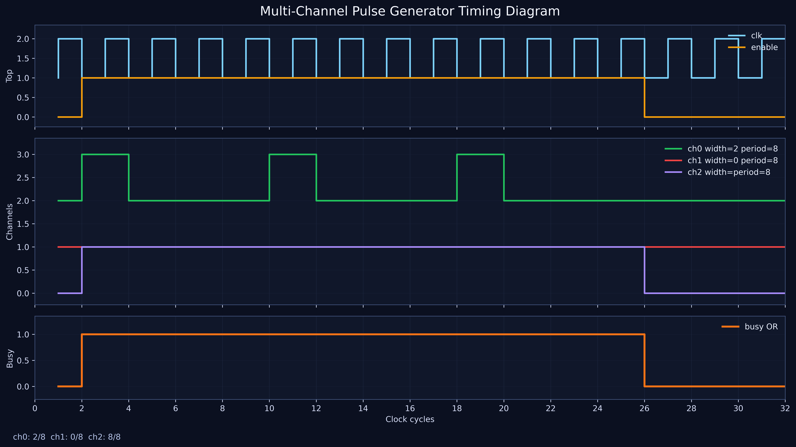

# QubitPulseGenerator
Multi-Channel Programmable Pulse Generator for Qubit Control



## Features
- Original `pulse_gen` core preserved unchanged.
- `multi_pulse_gen` wraps up to 4 independent channels with shared clock and reset.
- Parallel register-style control interface with combinational reads and synchronous writes.
- Per-channel `width`, `period`, and `enable` control.
- OR-ed `busy` output for system-level arbitration.
- Self-checking simulation benches for the scalar core and the multi-channel wrapper.
- Formal assertion module for `pulse_gen`.
- Python waveform generator that emits `docs/waveform.png` at 600 DPI.

## Quick Start
1. `git clone https://github.com/a0ax/QubitPulseGenerator.git`
2. `cd QubitPulseGenerator/scripts`
3. `make sim wave`

The waveform image is written to `docs/waveform.png`.

## Modules

### `pulse_gen`

#### Parameters
| Parameter | Default | Description |
| --- | ---: | --- |
| `WIDTH_BITS` | `8` | Width register size |
| `PERIOD_BITS` | `16` | Period register size |

#### Ports
| Port | Direction | Width | Description |
| --- | --- | --- | --- |
| `clk` | input | 1 | Clock |
| `rst_n` | input | 1 | Active-low reset |
| `enable` | input | 1 | Enables pulse generation |
| `width` | input | `WIDTH_BITS` | High-time in cycles |
| `period` | input | `PERIOD_BITS` | Period in cycles |
| `pulse` | output | 1 | Generated pulse |
| `busy` | output | 1 | High while the generator is active |

#### Instantiation
```systemverilog
pulse_gen #(
	.WIDTH_BITS(8),
	.PERIOD_BITS(16)
) u_pulse_gen (
	.clk(clk),
	.rst_n(rst_n),
	.enable(enable),
	.width(width),
	.period(period),
	.pulse(pulse),
	.busy(busy)
);
```

### `multi_pulse_gen`

#### Parameters
| Parameter | Default | Description |
| --- | ---: | --- |
| `WIDTH_BITS` | `8` | Shared width register size |
| `PERIOD_BITS` | `16` | Shared period register size |
| `DATA_BITS` | `max(WIDTH_BITS, PERIOD_BITS)` | Parallel bus width |
| `NUM_CHANNELS` | `4` | Number of instantiated channels |

#### Ports
| Port | Direction | Width | Description |
| --- | --- | --- | --- |
| `clk` | input | 1 | Shared clock |
| `rst_n` | input | 1 | Active-low reset |
| `channel_sel` | input | 2 | Channel selector |
| `wr_en` | input | 1 | Write strobe |
| `addr` | input | 2 | Register address: `0=width`, `1=period`, `2=control` |
| `wr_data` | input | `DATA_BITS` | Write data |
| `rd_data` | output | `DATA_BITS` | Combinational read data |
| `pulse_out` | output | `NUM_CHANNELS` | Per-channel pulses |
| `busy` | output | 1 | OR of all channel busy signals |

#### Instantiation
```systemverilog
multi_pulse_gen #(
	.WIDTH_BITS(8),
	.PERIOD_BITS(16),
	.NUM_CHANNELS(4)
) u_multi_pulse_gen (
	.clk(clk),
	.rst_n(rst_n),
	.channel_sel(channel_sel),
	.wr_en(wr_en),
	.addr(addr),
	.wr_data(wr_data),
	.rd_data(rd_data),
	.pulse_out(pulse_out),
	.busy(busy)
);
```

## Simulation

### Existing script
The legacy simulator script remains available for the scalar core:
```sh
cd scripts
vsim -c -do sim.do
```
or
```sh
cd scripts
vivado -mode batch -source sim.do
```

### Scalar testbench
`sim/tb_pulse_gen.sv` is a bounded, self-checking testbench with edge cases and 50 randomized `(width, period)` pairs.

### Multi-channel testbench
`sim/tb_multi_pulse_gen.sv` programs all four channels, checks register reads, verifies independent pulse streams, and exercises the OR-ed `busy` output.

### Icarus Verilog flow
```sh
iverilog -g2012 -o build/tb_pulse_gen.vvp rtl/pulse_gen.sv sim/tb_pulse_gen.sv
vvp build/tb_pulse_gen.vvp

iverilog -g2012 -o build/tb_multi_pulse_gen.vvp rtl/pulse_gen.sv rtl/multi_pulse_gen.sv sim/tb_multi_pulse_gen.sv
vvp build/tb_multi_pulse_gen.vvp
```

## Synthesis
Vivado can target either the scalar core or the multi-channel wrapper.

```tcl
create_project pulse_gen ./build -part xc7a100tcsg324-1
add_files ../rtl/pulse_gen.sv
add_files ../rtl/multi_pulse_gen.sv
add_files -fileset constrs_1 ../constraints/pulse_gen.xdc
launch_runs impl_1 -to_step write_bitstream
wait_on_run impl_1
```

Use `multi_pulse_gen` as the top level when you want the multi-channel subsystem.

## Testing
- `sim/tb_pulse_gen.sv` checks reset, disabled behavior, `width=0`, `period=0`, `width=period`, `width>period`, enable toggling, reset during operation, and 50 randomized cases.
- `sim/tb_multi_pulse_gen.sv` checks register programming, readback, independent channel output timing, and `busy` aggregation.
- `sim/pulse_gen_assert.sv` can be bound to `pulse_gen` for formal or assertion-based simulation.

## Waveform
The generated timing diagram is shown below and is created by `scripts/generate_waveform.py`.


## Timing Closure
```tcl
report_timing_summary -delay_type max -report_unconstrained -max_paths 10 -file timing_summary.rpt
```

Verify in `timing_summary.rpt` that `WNS >= 0` and Fmax exceeds 100 MHz.
